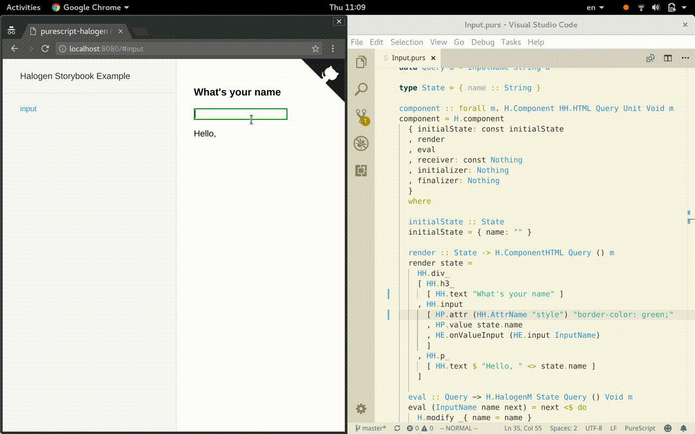

# purescript-halogen HMR Example



## How to

1. copy `src/Halogen.Component.patch.js` to your codebase
2. change `webpack.config.js` to point `Halogen.Component/index.js` to the patched version
  ```
    alias: {
      "../Halogen.Component/index.js": "Halogen.Component.patch.js"
    }
  ```
3. setup hmr in your entry script
  ```
  if (module.hot) {
    module.hot.accept("Main", function() {
      document.body.innerHTML = "";
      require("Main").main();
    });
  }
  ```

NOTE: only tested with [purescript-halogen](https://github.com/slamdata/purescript-halogen) master.
